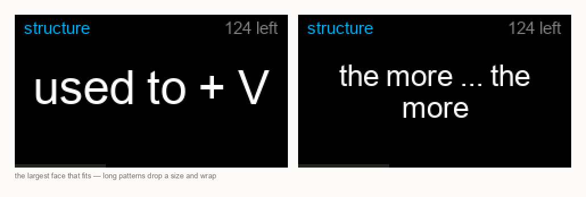

<h1 align="center">vocab-display</h1>

<p align="center">
  <b>A vocabulary card that lives on your desk, not in another app you forget to open.</b>
</p>

<p align="center">
  One small set of English words and sentence patterns each day, with Vietnamese meanings,<br>
  on a $10 screen that is simply always on.
</p>

<p align="center">
  
  
  
  
  
</p>

<p align="center">
  
</p>

---

Reviewing vocabulary fails on the opening step: opening the app. This removes that step.
The screen sits next to the keyboard showing one word, pauses long enough for you to try
to recall the meaning, then reveals it — and keeps doing that all day whether or not you
were paying attention.

## Why it works the way it does

- 📅 **One set a day, repeated.** Twelve entries — eight words, four patterns, interleaved
  — cycle in about three minutes. A day at the desk shows each one dozens of times.
  Tomorrow draws a different set. The deck is deliberately *not* raced through.
- 🔤 **Real Vietnamese, not stripped accents.** `đã quen với việc`, not `da quen voi viec`.
  Tone marks stay legible down to 16px.
- 🧠 **It knows what you already know.** One button press marks an entry known and it never
  returns; a replacement joins the day so the dose stays the same.
- 🔌 **It works on power alone.** The starter deck is compiled into the firmware. No Wi-Fi,
  no host, no account needed to get value out of it.
- 🌐 **A web page when you want one.** Run the host and the deck becomes searchable,
  editable in place, and importable in bulk — served by a standard-library Python script
  with no npm, no pip, and no build step.
- 🚫 **Nothing leaves your network.** No cloud, no API keys, no telemetry.

## Try it in five minutes

```bash
cp include/config.example.h include/config.h    # Wi-Fi and host, optional
PY=python3 tools/gen_assets.sh                  # build the deck and the fonts
pio run -t upload
```

That is the whole offline device: 122 entries in flash, progress in NVS. For the web UI:

```bash
python3 host/server.py        # http://localhost:8788
```

<p align="center">
  
</p>

<p align="center"><sub>Terms range from <code>afford</code> to <code>there's no point in + V-ing</code>, so the
type size is chosen per card — the largest face that fits, dropping a size and wrapping only when it has to.</sub></p>

## One set a day

The deck is not worked through front to back. Each day gets one fixed set and the board
repeats it all day; tomorrow draws another, chosen from whatever has been practised least.

`GET /api/batch` is idempotent for exactly this reason: the board re-asks every few minutes
and every answer has to be the same set, or the day stops being a day. The day boundary is
the host's local date, since the host runs on the same machine as the person.

**`days` is the number that means something.** With one set repeated all day, `seen` climbs
past a hundred within hours and stops distinguishing anything. `days` counts the distinct
days an entry has appeared, is incremented by the host exactly once when it builds a set,
and is what tomorrow's set is chosen by.

Marking an entry known pulls it out of today's set and a replacement is drawn, so the day
keeps its size. Changing the dose reshapes the current day immediately rather than waiting
for tomorrow — quotas are honoured per type, which is not the same as honouring the total:
filling from one mixed pool turned a requested 8 + 4 into 9 + 3.

## Vietnamese needs a real font

TFT_eSPI's built-in fonts are ASCII only: no `ă â ê ô ơ ư đ`, no tone marks. Vietnamese
renders as blanks or boxes. The fix is a smooth **VLW** font converted from a TTF with the
Vietnamese range included.

TFT_eSPI's own converter is a Processing sketch — a Java IDE to produce one binary file —
so [`tools/ttf2vlw.py`](tools/ttf2vlw.py) does the same job from the command line, and
regenerating a font after changing a size stays part of the normal build.

| Size | Character set | Used for | Cost |
|-----:|---------------|----------|-----:|
| 42px | ASCII | the term, when it fits | 61 KB |
| 26px | ASCII | long terms, wrapped | 25 KB |
| 22px | + Vietnamese | the meaning | 57 KB |
| 15px | + Vietnamese | labels and the example | 30 KB |

Fronts are always English, so those sizes carry 95 glyphs instead of 229 — which is where
most of the saving comes from. `TTF=` in
[`tools/gen_assets.sh`](tools/gen_assets.sh) selects the source font; something designed
for Vietnamese, like Be Vietnam Pro, places tone marks better at small sizes than a
general-purpose face.

## The deck

[`data/seed.tsv`](data/seed.tsv) is the starting knowledge base — 122 entries of
high-frequency English with Vietnamese meanings. Tab-separated because Vietnamese meanings
are full of commas and quoting them in CSV buys nothing.

| Column | Meaning |
|--------|---------|
| `id` | Stable integer. **Never reuse or renumber** — progress is keyed off it |
| `type` | `word` or `structure` (patterns like `used to + V`, `end up + V-ing`) |
| `level` | `A2` / `B1` / `B2` |
| `front` | The English term or pattern |
| `back` | Vietnamese meaning |
| `example` | One short English sentence |

It covers both plain vocabulary and the patterns that trip learners up more than single
words do — `be used to + V-ing` versus `used to + V`, `so ... that`,
`there's no point in + V-ing`.

## How the board and host share the work

```
   browser ──▶ host (Python, stdlib)  ──▶  data/store.json
                    ▲
                    │  GET  /api/batch     today's set
                    │  POST /api/progress  what was shown, what was marked known
                    │
                  board ────  122 entries compiled into flash = the floor
```

**The compiled deck is the floor, not a fallback bolted on afterwards.** The board renders
its first card before Wi-Fi is even attempted, because joining a network takes seconds and
resolving a host takes more, and none of that belongs between power and the first word.

**A failed refresh replays today's set rather than abandoning it.** A day's set drains
every few minutes, so treating one miss as "the host is gone" would drop the board onto the
full compiled deck and start showing words outside today's set. It takes three consecutive
misses to fall back.

**Source changes land on card boundaries.** The loop only raises a flag; `nextCard()` does
the fetching. Fetching where the timer notices it would swap the batch out from under a
card still on screen.

**Progress goes out every five cards, not every card**, because the host rewrites its whole
store per write. Marking known reports immediately — that is the one change worth a round
trip of its own. A failed report backs off for a minute: a refused connection answers
instantly, but a sleeping Mac never answers at all, and seven attempts per cycle froze the
timer bar for about ten seconds.

**Progress accumulates, and `known` is never un-set.** Adding is not idempotent — a report
whose response is lost gets re-sent and double-counts. That is deliberate; `seen` is a soft
signal and `days` is the one to trust.

A dot appears in the corner while running from the compiled deck. Deliberately not a word:
offline is a normal state, not a fault, and does not deserve a banner.

## Why the board's memory is not the constraint

The obvious worry is whether an ESP32 can hold a growing knowledge base plus progress.
Measured against the real seed file, one entry averages **70 bytes**:

| Entries | Content | Progress | Fits in board RAM? |
|--------:|--------:|---------:|:-------------------|
| 122 | 8 KB | 1.0 KB | yes |
| 1,000 | 68 KB | 7.8 KB | yes, but eats 40% of free RAM |
| 3,000 | 205 KB | 23 KB | no |
| 10,000 | 682 KB | 78 KB | no |

A few thousand entries genuinely will not fit — but they never need to. **A day's set of
twelve costs under a kilobyte.** Storage size stops being a firmware problem and becomes a
host problem, where a plain file is the whole answer.

## Measured on the device

| | |
|---|---|
| Flash | 38% of 3 MB (`huge_app`), of which 173 KB is font data |
| Free heap | 165 KB with Wi-Fi up, flat over a long run |
| Vietnamese | legible from 16px; tone marks and `đ` stay distinct |
| Longest term | `there's no point in + V-ing` drops a size and wraps to two lines |
| Longest meaning | `có đủ khả năng (tài chính) để làm gì` wraps to two lines and still leaves room for a two-line example |
| Progress | survives a reboot — marked 3 known, power-cycled, still 119 remaining |
| Daily set | idempotent across repeated requests; a simulated rollover drew 12 fresh entries with zero overlap |
| Host loss | two drained cycles replay today's set, the third falls back to the compiled deck |

Wi-Fi, HTTPClient, mDNS and ArduinoJson together put the app at 92% of the default 1.31 MB
partition — too little headroom to add anything — so `platformio.ini` switches to
`huge_app`, trading the second OTA slot for a ~3 MB single app partition. That costs nothing
on a board flashed over USB.

## Working on the layout

135 pixels of height goes fast, and squinting at a 1.14" panel is a poor way to find out
whether a long term overflowed. The `debug-screenshot` build streams the framebuffer back
over serial, so every screenshot in this README is real pixels off the device:

```bash
pio run -e debug-screenshot -t upload
python3 tools/screenshot.py /dev/cu.usbserial-XXXX 'card-{}.png' --sides front,back
```

Debug console: `f`/`b` pick the side, `n` next card, `j###` jumps to a position in the set,
`h` forces a fetch, `p` forces a report, `o` forces offline, `k` marks known, `r` clears
progress, `q` reports state and free heap, `s` dumps the framebuffer.

Capture everything you want in one invocation — opening the port resets the board on this
hardware, so a separate run per shot means a reboot per shot and most land on a device
still joining the network. The tool waits for the boot banner and fails loudly rather than
handing back a picture of a half-booted screen.

## The host API

Browser requests come from the machine itself and carry no token; the board's two endpoints
do. The token exists so nothing else on the Wi-Fi can read or rewrite the deck — it travels
in cleartext over HTTP on a home network and is not real authentication.

| Endpoint | Who | Does |
|----------|-----|------|
| `GET /api/batch?n=` | board | today's set — the same answer all day |
| `POST /api/progress` | board | reports what it showed and what was marked known |
| `GET /api/entries` | browser | list, search, filter, paged 50 at a time |
| `PUT`/`DELETE /api/entries/<id>` | browser | edit in place, or remove |
| `POST /api/entries` | browser | add one |
| `POST /api/import` | browser | paste tab- or pipe-separated lines in bulk |
| `POST /api/config` | browser | how many words and patterns a day holds |
| `POST /api/rebuild-daily` | browser | discard today's set and draw another |
| `GET /api/stats` | browser | counts, today's set, and the token |

The store is written through a temp file and renamed. A half-written store is worse than a
stale one — the deck and every bit of progress live in that one file, and rename is the
only step that is atomic. Ids are never reused: progress is keyed off them, so a recycled
id would silently inherit the history of a deleted entry.

## Hardware

A [TTGO T-Display](https://www.espboards.dev/esp32/lilygo-ttgo-t-display-1-14/) — ESP32
with a 1.14" 135×240 ST7789. Around $10. Two buttons: one advances, one marks known
(hold it for the backlight).

It runs from USB. A 3.7V LiPo with a **protection circuit** and a JST 1.25 connector makes
it portable — the board's TP4054 only charges and has no low-voltage cutoff, so a bare cell
will be drained past the point of damage. Check the connector polarity with a meter before
plugging anything in; it is not standardised, and reversed polarity kills the board.

## Sibling project

[claude-tracker](https://github.com/tam-nguyen-coder/claude-tracker) drives the same board
as a Claude Code status light. The firmware here borrows its TFT setup, text wrapping and
screenshot tooling; they are separate repos because they share hardware, not purpose.
